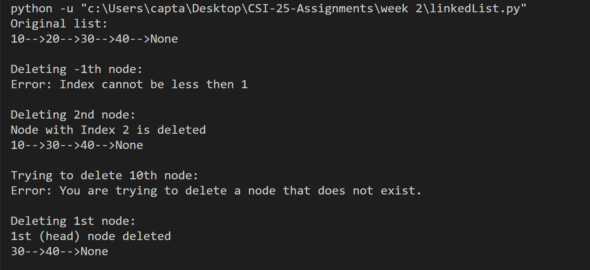
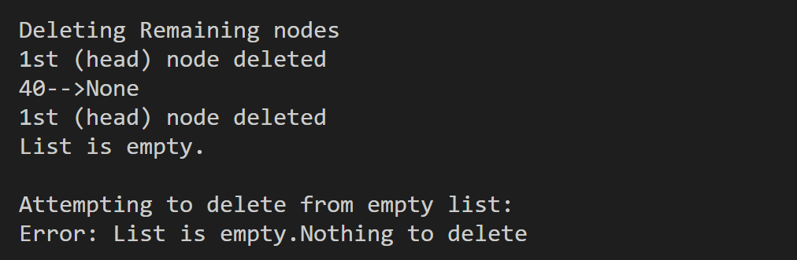

Output of the code is :

This project contains a simple implementation of a singly linked list using Python. It is designed to help beginners understand how linked lists work and how to perform basic operations like appending, printing, and deleting nodes.

Features
 Node Class
 Represents each element in the list. Each node contains:

Data
 A pointer to the next node

LinkedList Class
 Manages the linked list. It includes the following methods:

append(data)
 Adds a new node with the given data to the end of the list.

print_list()
 Prints all the elements in the list from head to tail.

delete(n)
Deletes the node at the given 1-based index position.

Error Handling
The program handles invalid cases such as:

Deleting from an empty list

Invalid index values (like negative or too large)

Deleting the first node

How to Run
Make sure you have Python installed.

Save the code in a file called linked_list.py.

Open a terminal or command prompt.

Run the file using the command:

python linked_list.py

Output Example
The script demonstrates:

Adding elements to the list

Deleting specific nodes

Handling edge cases like deleting from an empty list